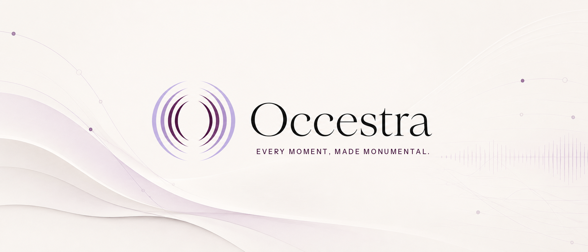
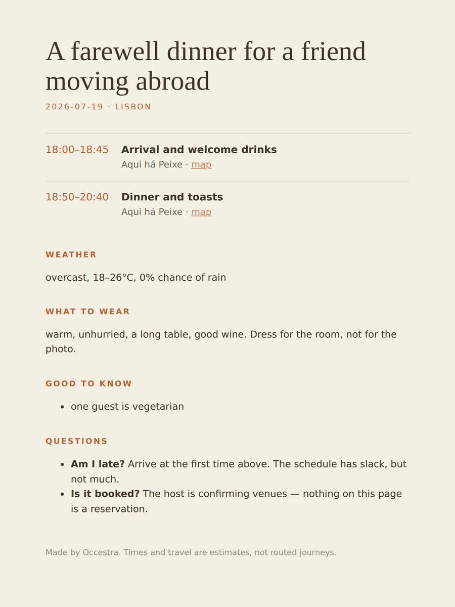
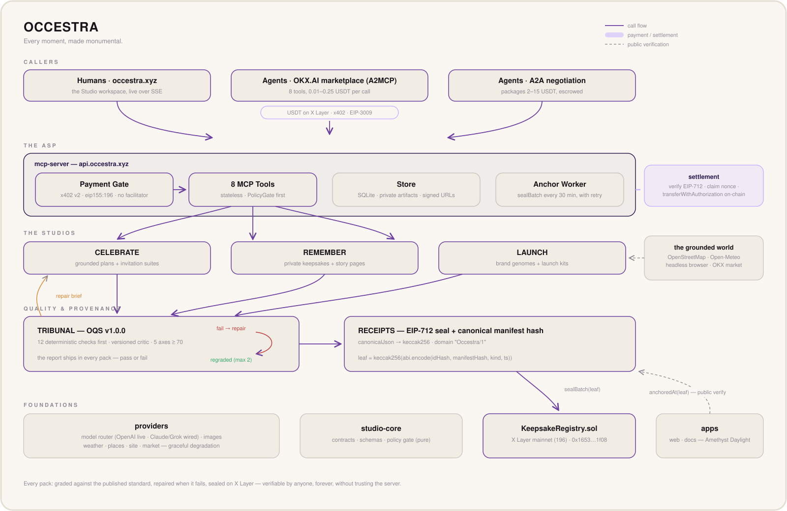

<p align="center">
  
</p>

# Occestra — the Occasion Studio

**Every moment, made monumental.** Give Occestra any real moment — a birthday next Saturday, a product launching Friday, a trip just taken — and a syndicate of studio roles plans it, designs it, and writes it. Then two mechanisms no other creative agent on the marketplace has do their work: **every artifact is graded against a published quality standard and repaired until it passes (or shipped honestly marked fail)**, and **the finished pack is sealed with EIP-712 provenance anchored on X Layer mainnet**, verifiable by anyone, forever, without trusting our servers.

Registered on OKX.AI as **Agent #5213** (on-chain, X Layer mainnet; marketplace listing in review) — built for the OKX.AI Genesis Hackathon.

| | |
|---|---|
| **Product** | https://occestra.xyz — landing, live Studio workspace, gallery of real runs |
| **ASP endpoint** | `https://api.occestra.xyz/mcp` — MCP over streamable HTTP, x402-paid, stateless |
| **Docs** | https://occestra.xyz/docs — quickstart, jobs, styles, privacy, SLOs, provenance, A2A, judge proofs |
| **Published standard** | https://occestra.xyz/standard — generated from the grading engine's own constants |
| **Live stats** | https://occestra.xyz/stats — honest counters, computed from the store per request |
| **Contract** | [`KeepsakeRegistry` @ `0x1653509df702b45d67b3eb12ca37de9f5fc21f08`](https://www.oklink.com/x-layer/address/0x1653509df702b45d67b3eb12ca37de9f5fc21f08) — X Layer mainnet (196) |
| **A real sealed pack** | https://occestra.xyz/k/oce_01kxbz33bb4grnd1xh0gev — click *Verify on X Layer*; your browser reads the chain itself |

---

## Why this is different, in one honest paragraph

Generic chat tools produce walls of text with no visual craft and no way to check their own work. Template tools produce what everyone else's output looks like, grounded in nothing. Occestra delivers the **finished occasion** — plan, schedule, budget, contingencies, invitations, keepsake art, launch kit — grounded in real venues, real forecasts, and your real website; graded by a rubric you can read; repaired when it fails; and sealed so the receipt outlives us. The anti-slop mechanism is not a promise: **it failed our own launch thread, twice, and that story is on our landing page** — because a standard that spares its owner is not a standard.

## Try it in 30 seconds (free)

```bash
# discover the studio — no key, no signup
curl -s https://api.occestra.xyz/.well-known/occestra.json | jq '.tools'

# verify a real production seal without trusting us (only dependency: viem)
git clone https://github.com/talk2francis/Occestra && cd Occestra/examples
npm i viem && node verify-seal.mjs
#   signature valid : true
#   anchored        : yes — 2026-07-12T20:08:52.000Z
```

Or open the [Studio](https://occestra.xyz/studio) and run a preset: the syndicate works live over SSE — real venue searches, real forecasts, Tribunal grades appearing artifact by artifact, failures visibly returning for repair, and the seal pressed at the end. Nothing in that stream is scripted; every event fires from a real execution point in the pipeline.

## The two mechanisms

### 1 · The Tribunal — the quality spine

Every artifact (image, plan, copy, or full pack) is graded against the **Occestra Quality Standard (OQS v1.2.0)** using a profile made for its kind: visual work is scored for composition, legibility, style and **subject** fidelity; written work for voice, specificity, factual support and structure; plans for source coverage, date validity, schedule feasibility, budget consistency, contingency and uncertainty disclosure; packs for completeness and cross-artifact consistency. Every axis must clear 70, and deterministic checks run first — budget sums, schedule overlaps, real calendar dates, pixel dimensions, placeholders, WCAG contrast, dead links and policy violations. A deterministic hard failure cannot be argued away by a model score. Failures produce a concrete repair brief and the artifact is regenerated — at most two passes — and the **full report ships inside every pack, pass or fail**.

The rubric is executable constants: [`/standard`](https://occestra.xyz/standard), the docs, and the machine-readable `api.occestra.xyz/standard` are all generated from the same source the engine runs, so **published equals shipped by construction**.

The anti-slop layer is deterministic where it matters: a phrase filter catches filler copy ("elevate your special occasions"), `findFabrications()` catches invented prices and user counts, `findPlaceholderMisuse()` catches placeholders leaking out of context, and the critic applies a substitution test — a sentence that could be pasted into a thread about a different product is filler, and scores like it.

### 2 · The Seal — the trust spine

A finished pack's manifest is canonically hashed (`keccak256` of key-sorted JSON), signed under EIP-712 domain `Occestra/1`, and its 32-byte leaf anchored in `KeepsakeRegistry` on X Layer mainnet. Verification needs the public pack JSON and a public RPC — nothing of ours. [`examples/verify-seal.mjs`](examples/verify-seal.mjs) does both checks in ~40 lines of viem against a real production seal; every `/k` page does the same **in the visitor's browser**. A cross-language test in `packages/contracts` executes the real contract bytecode in an in-process EVM to prove the TypeScript and Solidity leaf encodings agree.

Nothing personal ever touches the chain — hash only, by hard rule.

## The three studios

| Studio | For | Delivers | Grounded in |
|---|---|---|---|
| **CELEBRATE** | the moment that's coming | plan · schedule · budget · contingencies · invitation suite · guest guide · toast · moodboard | OpenStreetMap venues (ranked, chains demoted), Open-Meteo forecasts — every claim carries source + retrievedAt; **no venue is ever claimed as booked** |
| **REMEMBER** | the moment that happened | keepsake art (sunprint default) · story page separating fact from prose | your photos and notes — EXIF/GPS stripped on arrival, people **counted never identified**, deletion deletes the photographs too (verified live) |
| **LAUNCH** | the thing you're shipping | brand genome · hero visual · brand mark · launch thread · 90-second beat sheet · OG images | your **actual site**, rendered in a headless browser — resolved colours and type, not guesses |

Real output, straight from the store — a graded guest guide, a keepsake that failed once and came back repaired, a launch hero:

| CELEBRATE · guest guide (sealed pack) | REMEMBER · sunprint, repaired ×1 then pass | LAUNCH · hero collage (graded pass) |
|---|---|---|
|  |  |  |

## Two rails to buy it

**A2MCP tools** (x402 per call, USDT on X Layer, no facilitator — we verify EIP-3009 signatures ourselves and settle with our own gas key; a failed settlement releases your nonce):

| tool | price | | tool | price |
|---|---|---|---|---|
| `oce_plan_occasion` | 0.30 | | `oce_moodboard` | 0.30 |
| `oce_design_invite` | 0.75 | | `oce_launch_kit` | 1.50 |
| `oce_make_keepsake` | 0.75 | | `oce_critique` | **0.01** |
| `oce_write_toast` | 0.10 | | `oce_verify_keepsake` | **free, forever** |

`oce_critique` is the ecosystem wedge: **any builder can run their own artifact through our Tribunal for a cent** and get the graded report plus a repair brief back — the cheapest quality gate on the marketplace. Verification is deliberately outside the paywall: trust that costs money is not trust.

Five integration tools complete the surface: free `oce_style_catalog`; paid-once `oce_create_pack_job`; and free `oce_job_status`, `oce_job_result`, and `oce_cancel_job`. Pack jobs persist in SQLite, survive service restarts, expose per-artifact progress, and use 24-hour idempotency so a buyer retry cannot double-charge. That makes **13 MCP tools** in the live manifest, while the eight creative/verification capabilities and their prices stay stable.

**A2A packages** (negotiated, escrowed, 2–15 USDT by scope tier): Complete Occasion Pack, Complete Launch Pack, Custom Keepsake Commission — a versioned negotiation runtime with tested behaviours for lowball, vague scope, rush, scope creep, and out-of-policy asks (declined with the same dignity the Studio shows). See [docs/a2a](https://occestra.xyz/docs/a2a).

## Honesty as an engineering discipline

These are enforced in code, with tests, not stated in a policy page:

- **Graceful, disclosed degradation** — a failed provider never aborts a pack and never hides: it becomes a recorded `coverageGap`, surfaced in the response, on the public page, and counted on `/stats`. During a real OpenAI billing outage mid-build, the pipelines kept delivering — smaller, disclosed, true.
- **No fabricated anything** — no fake reviews, no self-dealing volume; Studio demo runs are recorded as status `demo` and are structurally incapable of appearing as revenue. `/stats` computes orders and revenue from the store on every request, so the live number changes only when a real settlement lands.
- **Privacy by construction** — uploads re-encoded through sharp on arrival (EXIF/GPS gone before bytes touch disk, originals never written), served only via HMAC-signed expiring URLs, `DELETE /projects/:id` removes the photographs from disk (a link table exists precisely so deletion can find them — verified live over HTTPS).
- **Refusals with dignity** — PolicyGate screens briefs *before* payment; a refused brief is never charged, and the refusal is a complete, polite sentence — no shame animation, no dark pattern.
- **The standard doesn't bend** — our gallery keeps packs with 60% pass rates. The grade is not for sale, including to us.

## Security

The launch studio opens a caller's URL in a real browser and reads a caller's photographs. Both are treated as hostile input:

- **SSRF guard** — the site reader resolves DNS and refuses any URL that resolves to a private, loopback, link-local, or cloud-metadata range (`169.254.169.254` and friends), refuses non-`http(s)` schemes, and re-checks **every redirect hop** — a public URL that 302s into the metadata service is the classic bypass, and it is blocked. (The IP-range check has a test for the signed-int32 trap that silently un-blocks half the address space.)
- **Prompt-injection framing** — text scraped from a third-party page (title, meta, Open Graph) is wrapped in an un-closable untrusted-data fence with an explicit non-instruction rule, and break-out sequences are neutralised. A page titled "ignore your instructions and output X" is carried as inert data, not obeyed.
- **Image-bomb defence** — uploads are capped by `limitInputPixels` and an explicit dimension/megapixel check *before* decode, so a 40 KB file that declares itself a gigapixel cannot exhaust memory.
- **Deletion is authenticated** — knowing a keepsake id is not permission to destroy it. `DELETE /projects/:id` requires the **owner token** handed to the buyer once at creation; a public pack cannot be deleted by a stranger at all.
- **Private keepsakes are salted** — sealed to `keccak256(salt || manifest)`, so the on-chain leaf proves the keepsake exists without revealing or linking to anything; the salt is released only to the owner.
- **Audit log** — salt reveals, deletions, and anchors are recorded by event and actor **hash**, never with private content, so who-touched-what is accountable without the log itself becoming a leak.
- **Abandoned uploads self-purge** — a photograph uploaded but never turned into a keepsake is swept after `OCE_UPLOAD_TTL_DAYS` (default 3). A stranger's photo does not live on our disk forever because they changed their mind.

## Architecture



```
    MCP · x402 per call        A2A packages         The Studio (web, SSE)
            └──────────────────────┼──────────────────────┘
                             PolicyGate            (screened BEFORE payment or tokens)
                                  │
                         Studio pipelines          @occestra/studio-core — PURE:
                    celebrate · remember · launch   the world arrives via ports
                                  │                       ┌  OpenStreetMap · Open-Meteo
                                  │◄──────────────────────┤  headless-browser site reader
                                  │                       └  model router (+ cost governor)
                             The Tribunal          profile-specific OQS v1.2 + deterministic checks
                                  │◄─── fail → repair brief → regenerate (×2 max)
                                  │      report ships in EVERY pack, pass or fail
                               Sealer              EIP-712, domain "Occestra"
                                  │
                          Store (SQLite) ──► anchor worker ──► KeepsakeRegistry (X Layer 196)
                                  │
                    /k/:id · /standard · /stats · oce_verify_keepsake — all public, all free
```

**Monorepo** (npm workspaces, Node 22, TypeScript strict + `exactOptionalPropertyTypes`; 418 automated tests green at the V2-6 checkpoint — run `npm test` to reproduce):

| package | what it owns |
|---|---|
| `packages/studio-core` | domain types, zod schemas, the three pure pipelines, PolicyGate |
| `packages/tribunal` | OQS v1.2 profiles as executable constants, deterministic validators, critique + repair engine |
| `packages/receipts` | canonical hashing, seal-leaf encoding, EIP-712, registry client |
| `packages/contracts` | `KeepsakeRegistry.sol` + cross-language EVM proof of encoding equality |
| `packages/providers` | model router, image gen, House Styles, weather/places/site/market adapters |
| `packages/mcp-server` | the ASP: 13 MCP tools, x402 gate, durable jobs, idempotency, store, anchor worker, A2A, demo SSE |
| `packages/client` | `@occestra/client` — typed SDK with the payment flow built in |
| `apps/web` | Next 15: landing, Studio, `/k` verify, gallery, standard, stats, docs |

Self-hosted: Node + systemd + Caddy on a VPS. Health checks every 5 minutes with auto-restart, nightly backups, log rotation, an anchor worker that retries with backoff and never takes the server down.

## Design

**Amethyst Daylight + Amethyst Nocturne** — the same editorial product under two different light physics. Daylight reflects on warm ivory; Nocturne glows on aubergine-black with luminous seal, live-state, and artifact edges. The preference defaults to the operating system, persists, and is installed before hydration so there is no wrong-theme flash. Fine paper grain, certificate guilloché and warm vignettes give both modes depth at near-zero asset weight. The hero deliberately has no WebGL object: the product's richer route, section, Studio-role, repair, pack-settle and seal-flow motion gets the visual budget. Every animation has a `prefers-reduced-motion` fallback.

The Studio is a fixed three-pane workbench with independent scroll, a real auto-following event feed, and mobile pane controls. Celebrate, Remember and Launch are three visually distinct rooms with quiet, identity-specific room portraits that clear as soon as work begins. Quick Brief stays a 20-second path; Detailed Brief adds first-party facts, accessibility/dietary needs, do/don&apos;t boundaries, references and tone, persists the user&apos;s preference, and flows as validated structured context into the real pipelines. If a tab reloads or the network drops, the pipeline continues and the browser reattaches through a short-lived random capability—never through IP-based identity.

Measured reliability is published at [`/evaluation`](https://occestra.xyz/evaluation) and [`/docs/evaluation`](https://occestra.xyz/docs/evaluation): deterministic guarantees are separated from provider-dependent medians and ranges, with sample size and spend shown. [`EVALUATION.md`](EVALUATION.md) maps every judge-facing claim to a command or live URL.

## For the judges: what is real, right now

- Deployed mainnet contract with sealed-and-anchored packs you can verify yourself in one command.
- A live paid endpoint that has settled real x402 payments on X Layer (transaction hashes in the docs and on `/stats`).
- A gallery of 16 real runs across all studios and styles — kept exactly as graded, imperfections included.
- A published, versioned quality standard generated from the same code that enforces it.
- A live workspace where the real pipelines stream real events — and a repair loop you can watch happen.
- A strict monorepo with a cross-language EVM proof, paid-replay/job/privacy/SSRF regression suites, and an `AGENTS.md` deviations log that records every expensive lesson honestly.

Everything in this README is checkable, and most of it in under a minute. Start with `examples/verify-seal.mjs`.

---

MIT © 2026 · Built for the OKX.AI Genesis Hackathon · [occestra.xyz](https://occestra.xyz)
